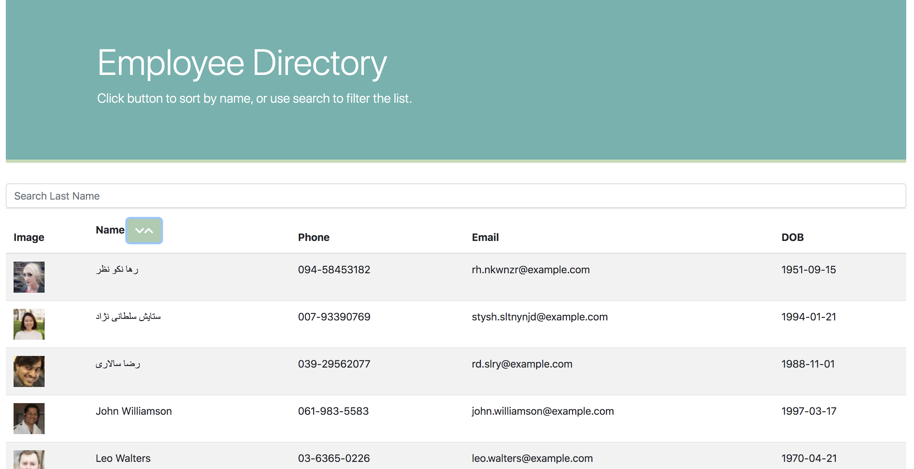

# employee-directory

A React Employee Directory, populated with data from the https://randomuser.me API with sort and filter functionality.

## Use

Click the button and the list will sort alphabetically by last name:

Click again and it will resort in descending order:

To search for a specific employee, enter a few letters in the search bar and the list will be filtered in real time:

## The Code

Each piece of the application is housed in its own component and brought together in the App.js file:

Data is populated from the <a href="https://randomuser.me">https://randomuser.me</a> API utilizing the <a href="https://www.npmjs.com/package/axios">axios</a> npm package to make the API call. The table is built and styled using Bootstrap.

## Deployment

The app is deployed at 
